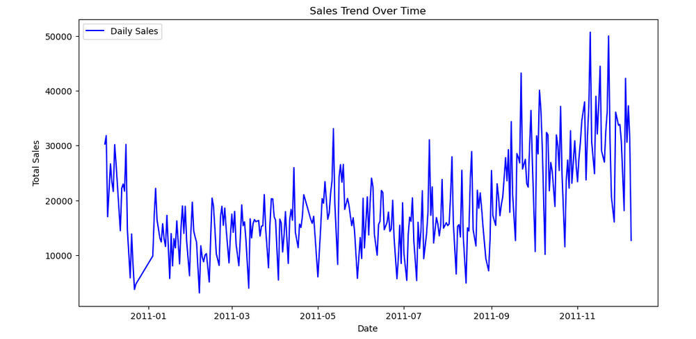
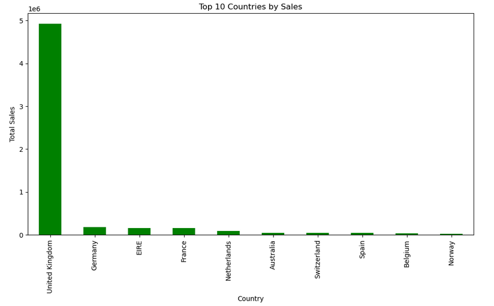
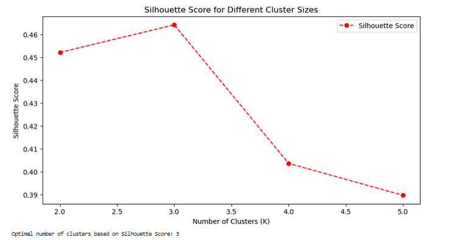
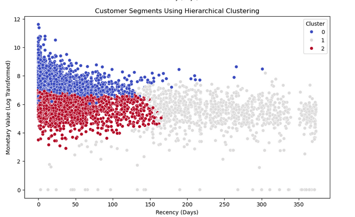
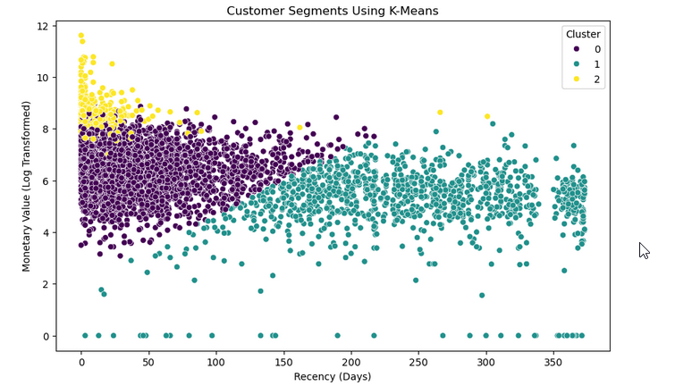
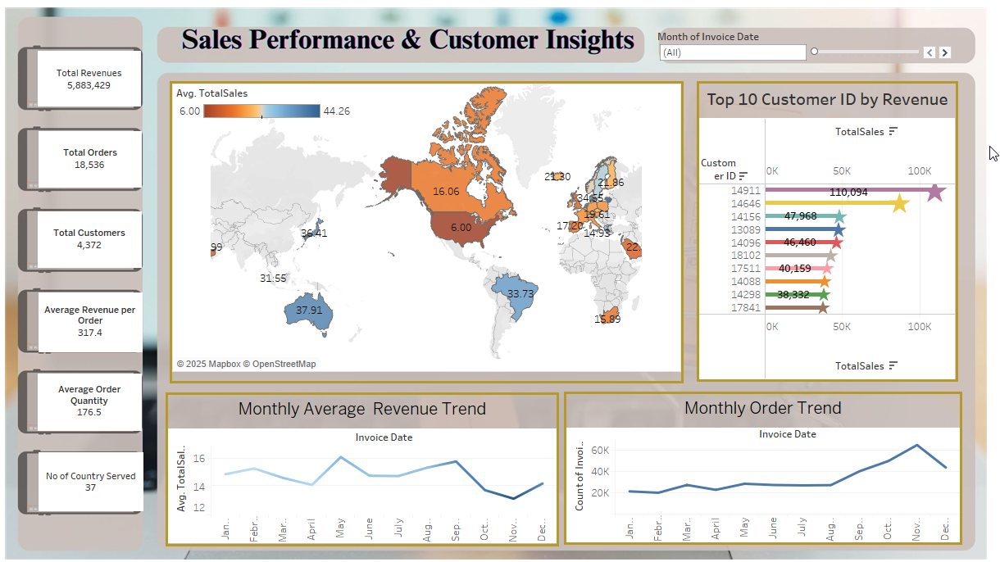

# Online Retail Data Analysis 📊

## 🌐 Quick Access Links
Access the key files for this project:
- 📓 **[Jupyter Notebook](./online_retails.ipynb)**: Core data analysis and machine learning workflows.
- 📑 **[Data Dictionary](./online_retailing_data_dictionary.pdf)**: Detailed column descriptions of the dataset.
- 🌐 **[Tableau Dashboard](https://public.tableau.com/views/online_retail_dashboard_17413829628300/Dashboard1?:language=en-US&publish=yes&:sid=&:redirect=auth&:display_count=n&:origin=viz_share_link)**.

## Project Overview 🌐

This project explores transactional data from a UK-based non-store online retailer specializing in unique, all-occasion gifts, primarily catering to wholesalers. The analysis period spans from December 2010 to December 2011, providing insights into sales trends, customer behavior, and product performance.

### Data Cleaning

- Missing values in `CustomerID` and `Description` were removed, impacting 24.93% and 0.27% of the dataset respectively.

### Outlier Management

- Outliers in `Quantity` and `UnitPrice` were managed through Winsorization, significantly reducing their distribution impact.

## Key Insights from Data Analysis 🔑

## Cancellation Trend Over Time

The cancellation trend shows significant fluctuations, peaking notably towards the end of the year. The total cancellation rate for the period is 2.19%, suggesting a need for further investigation into the causes of these spikes, which may be linked to seasonal sales increases.

## Daily Sales Trend Over Time

The sales data exhibit strong seasonality with peaks around specific times of the year, likely correlating with holidays and promotional events. Notable spikes in sales volume suggest successful marketing tactics during these periods.

## Top 10 Countries by Sales

Sales are predominantly concentrated in the United Kingdom, followed by Germany and EIRE, highlighting significant market potential in these regions. The UK alone accounts for the vast majority of total sales, suggesting a strategic focus on this market.

### Product Performance
- The top-selling product, "REGENCY CAKESTAND 3 TIER," generated 69,242.50.

### Customer Segmentation
-Conducted RFM analysis to segment customers based on transaction recency, frequency, and monetary value.
-The segmentation helped identify potential loyal customers who could be targeted for retention strategies.
## Clustering Analysis 🧑‍🤝‍🧑

- Applied K-Means clustering to segment customers into three distinct groups, helping tailor marketing efforts to specific customer behaviors.
- The optimal number of clusters, determined through silhouette scoring, was three, with a silhouette score of 0.4642, indicating moderately distinct clusters.

## Elbow Method for Optimal K

The inertia graph declines sharply between K=2 to K=3 and then plateaus, indicating that K=3 is the optimal number of clusters for segmenting this data set, minimizing within-cluster sum of squares.

## Silhouette Score for Different Cluster Sizes

The silhouette scores peak at K=3, with a score of approximately 0.464, indicating a reasonable structure has been captured by this clustering, though there's room for refinement.

## Customer Segmentation Using Hierarchical Clustering

This segmentation reveals three main clusters with clear differences in customer behavior based on recent interactions (recency) and spending (monetary value). The clusters suggest different targeting strategies for customer engagement.

## Customer Segmentation Using K-Means

The K-means clustering aligns with the hierarchical method, also suggesting three customer segments. This approach provides a foundation for personalized marketing campaigns based on the observed spending patterns and engagement levels.

## Sales Performance & Customer Insights Dashboard

- The dashboard encapsulates a total revenue of over 5.8 million from roughly 18,500 orders, serviced by 4,372 customers.
- It illustrates key metrics such as average revenue per order and monthly sales trends, providing a snapshot of business health and customer purchasing behavior.
- The geographic insights on the map show varied average sales across countries, useful for global strategy alignment.

## Conclusion 📜
- This analysis provides actionable insights into enhancing product offerings, improving customer engagement, and reducing cancellations.
